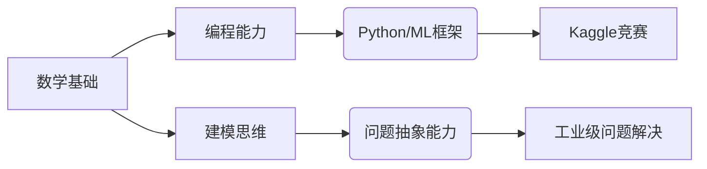

# 数学+AI交叉方向博士申请策略

## 背景分析
- **优势**
  - 数学基础扎实（GPA排名第三）
  - 数学学院背景认可度高
  - 具备课后习题熟练度 $\Rightarrow$ 可转化为算法实现能力
- **挑战**
  - 缺乏AI科研经历
  - 研究自信心不足
  - 排斥理论数学（$\exists x\in \text{最优化理论}: \text{困难度}(x) \gg \text{阈值}$）

## 交叉学科方向推荐
### 金融数学/量化金融
- **数学工具**
  - 随机过程
  - 偏微分方程
  - 时间序列分析
- **AI结合点**
  - 高频交易算法
  - 风险管理模型
  - 加密货币定价
- **就业前景**
  - 香港投行/对冲基金
  - 平均起薪$800k-1.2M HKD/year

### 计算生物学
- **数学工具**
  - 拓扑数据分析
  - 动力系统
  - 组合数学
- **AI结合点**
  - 蛋白质结构预测
  - 基因组学数据分析
  - 药物发现算法
- **研究优势**
  - 数学建模能力溢价
  - 生物医学领域funding充足

### 工业数学应用
- **推荐子方向**
  1. 供应链优化
  2. 智能制造系统
  3. 金融科技算法
- **方法论**
  - 离散数学+强化学习
  - 图论+网络优化
  - 数值分析+数字孪生

## 能力转化路径


## 申请策略
1. **背景提升**
   - 大三暑假参加Fintech/AI暑研
   - 选修CS院《机器学习》课程
   - 用数学建模竞赛转化论文（如MCM/ICM）
   
2. **选校定位**
   - 优先选择：
     - HKU FinTech
     - HKUST Big Data Technology  
     - CUHK Systems Engineering
   - 保底：
     - PolyU Applied Mathematics

3. **套磁技巧**
   - 重点联系有交叉背景的导师
   - 邮件主题公式：
     ```
     Math2AI: [您的数学背景] → [目标实验室研究方向]
     ```

## 职业发展矩阵
| 时间轴       | 学术界路径          | 工业界路径          |
|--------------|---------------------|---------------------|
| 博士期间     | 顶会论文+专利       | 企业合作项目        |
| 毕业3年内    | 博士后→教职         | Tech Lead           |
| 毕业5-8年   | 独立PI              | CTO/量化基金经理    |
| 薪酬期望     | $50k-80k HKD/month | $120k+ HKD/month   |

